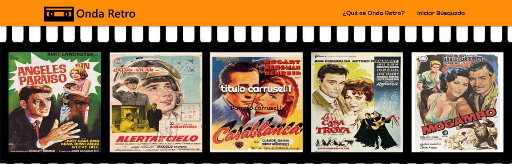
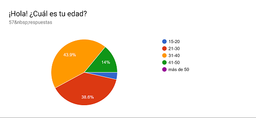
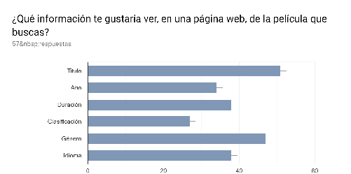
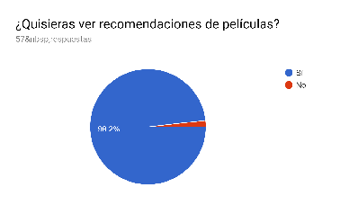
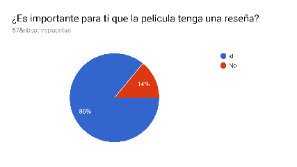
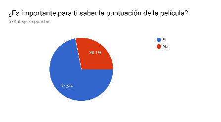
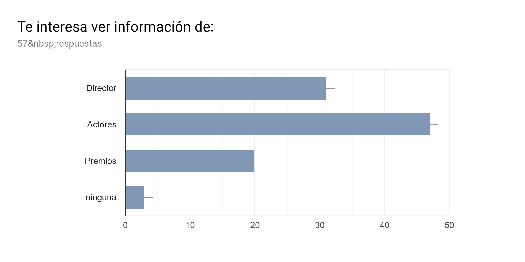
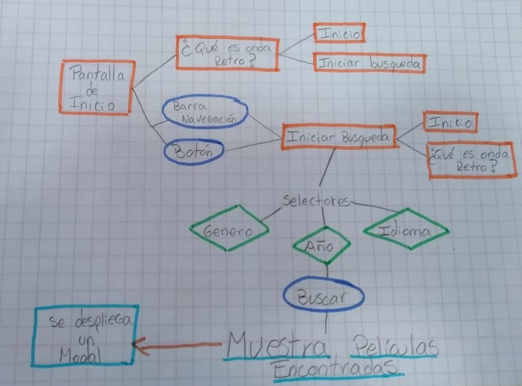
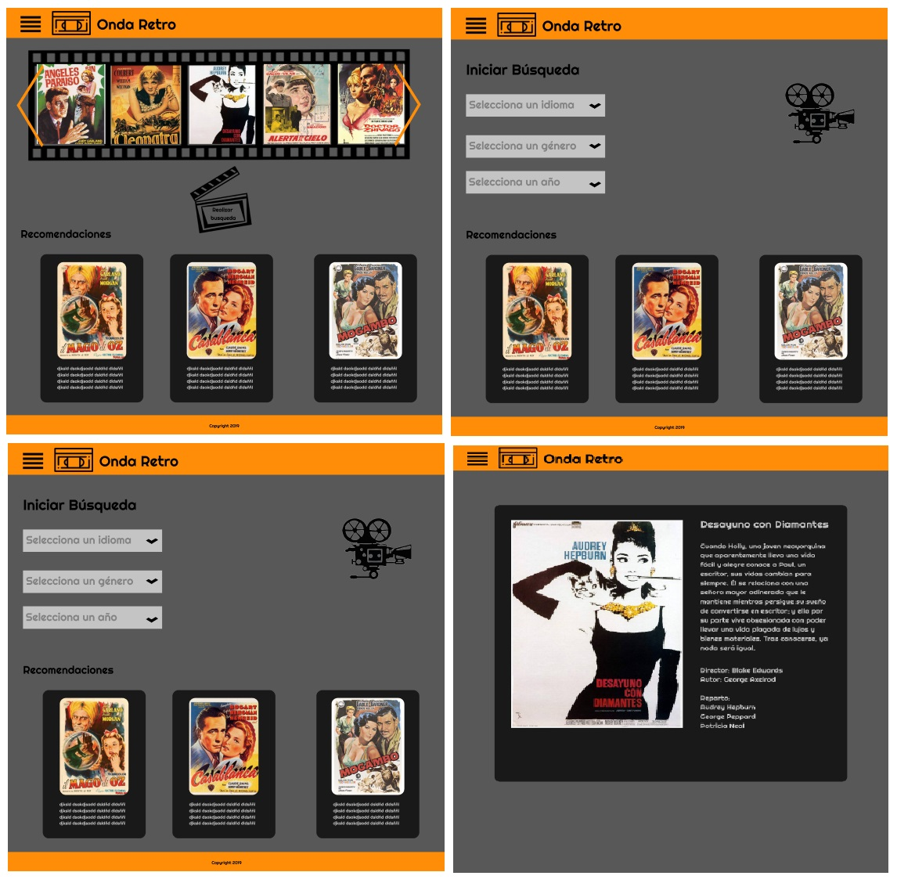

# ¡Bienvenido a Onda Retro!

## ¿Qué es Onda Retro? 

Esta es una aplicación centrada en entregar información de películas estrenadas entre los años 1940 y 1960, para un público adulto mayoritariamente de 21 a 40 años.

Podrás filtrar por año, género e idioma (español, inglés y portugués), además podrás ver algunas recomendaciones en el extremo inferior de la página; rescatando las películas de antaño. 

Se propone el desarrollo de un producto que se encuentre centrado en el público objetivo y que busque la adaptabilidad a sus necesidades y requerimientos. 

### Modo de uso

Para empezar a usar la interfaz, sólo debes clickear el icono central con la frase "realizar busqueda", esta acción te dirigirá a la pantalla dónde se encuentran las opciones de busqueda, puedes filtrar por año, género, y ademáspodrás filtrar por el idioma en el que quieres leer la información (español, inglés y portugués). Aparecerán en pantalla la o las imagenes que coincidan con tu busqueda. Para acceder a la información de la pelicula haz click en la imágen y se desplegará la información adicional.

## Planificación 🚀

En la organización utilizamos trello, delimitamos tareas y trabajamos con la metodología "pair programing".

### Definición: ¿Quién es nuestro usuario? 

Antes que nada, fabricamos una encuesta para saber qué tipo de información espera obtener la gente de una interfaz como la nuestra, y aproximar un rango de edad al que dirigirnos.

- Viendo que en su mayoría, quienes usan este tipo de páginas son personas de entre 21 a 40 años, decidimos enfocarnos en ese rango etario.

- Queríamos enfocarnos en tres filtros, las alternativas eran: título, año, duración, clasificación, género e idioma; y en base a lo que se muestra en el gráfico y nuestro proposito, decidímos hacerlo por género y duración, no descartando las otras posibilidades para el futuro.

-  Un 98.2% está interesado en obtener recomendaciones dentro de la interfaz.

- El 86% quiere tener a disposición una reseña de la película.

-  El 71% está interesado en saber la puntuación de las películas.

- Esta ultima pregunta, tiene a intención de saber qué podemos implementar más adelante, teniendo como prioridad, información sobre actores y directores de cada película, así como ambién el filtro por títulos.

 
### 1° Fase de Prototipado 📋

Una vez reconocido el usuario, comienza el proceso creativo compuesto por diferentes pasos que buscan dar con un resultado esperado por nosotras, pero principalmente pensado para el usuario. 

* Diagrama de flujo: esquema que grafica el flujo que debería tener la aplicación, considerando cambios de interfaces y filtración de información. 

### Planificación mediante Historias de Usuario ([Trello](https://trello.com/b/P3vXqQyX/hackathon-de-peliculas))

**¿Cuál es la necesidad de nuestro usuario?**

A partir de la encuesta realizada nacen distintas historias de usuario (**HU**)  que describen las necesidades de los usuarios, buscando cubrirlas a partir de los criterios de aceptación (**CA**) que se desarrollan en cada una de ellas.

A medida que se desarrolló Onda Retro se encontraron nuevas HU que permitieron generar una página completa y dinámica. 

1. **HU1**: Yo como amante del cine retro quiero ocupar esta aplicación desde mi computador para poder acceder a la información desde mi hogar.

**CA**: Crear esqueleto de HTML, definiendo las pantallas de la app y sus funcionalidades.

2. **HU2**: Yo como fanático del cine me gustaría poder filtrar las películas por año y así conocer las fechas de lanzamiento.

**CA**:Crear un selector donde el usuario pueda filtrar por año.

3. **HU3**: Yo como amante del cine me gustaría que me recomendarán películas que hayan sido aclamadas por la critica.

**CA**: Crear una sección en donde se muestren las películas seleccionadas.

4. **HU4**: Yo como aficionado al cine me gustaría poder filtrar por género y asi poder ver distintas películas.

**CA**: Crear un selector donde el usuario pueda filtrar por género de películas.

5. **HU5**: Yo como amante de las buenas películas quiero poder tener acceso a las reseñas en español y así poder elegir las mejores películas de la epoca.

**CA**:Crear una pantalla donde el usuario pueda filtrar por el idioma de las reseñas.

6. **HU6**: Yo como aficionado al cine quiero ver la ficha de la pelicula que seleccioné para poder conocer sus características.

**CA**: La página debe mostrar una ficha con las características de la película que el usuario seleccione. La ficha debe tener una imagen para identificarlo e información de su titulo, año, genero, reseña, etc.

Cada HU cuenta con una sección especial que abarca el formato responsivo. Buscamos que Onda Retro pueda ser visualizada desde pantallas de escritorio, Tablet y celular; entendiendo que el usuario utilizará la aplicación de manera transportable.

### Segunda fase de Prototipado 📄✒️

**- __Prototipo de baja fidelidad__**

A partir del diagrama de flujo y el reconocimiento del usuario, y por medio de lápiz y papel, se creó un boceto con las diferentes interfaces y usos que se proponen para la app web. 

**- __Prototipo de alta fidelidad__**

Al reconocer  al usuario se definió los colores,  el tipo de información y su distribución a desplegarse en la app web. A partir del prototipo de baja fidelidad se realizaron algunos ajustes en cuanto a la presentación de la página principal, tutorial y de búsqueda. 

Las tareas a realizar fueron:

- Buscar la película "Desayuno con diamantes del año 1961".
- Ser capaz de moverse entre las distintas pantallas de la aplicación.

* Dificultades identificadas a partir del prototipo de alta fidelidad:

1.	No se entiende los botones de la aplicación.
2.	Falta agregar los titulos a las peliculas encontradas.
3.	La ficha de la pelicula genera confusión, debido a que no tiene ningun boton para volver atrás o cerrarla.
4. Las recomendaciones ocupan mucho espacio en la página de inicio.

[Video 1 prototipo alta fidelidad](https://www.useloom.com/share/bb87929e20db4c1195231fc94798894e)  

[Video 2 prototipo alta fidelidad](https://www.useloom.com/share/9657f2f35bff481fa5911206925a21dc)  

[Video 3 prototipo alta fidelidad](https://www.useloom.com/share/6efcf8e239944482a33c76253ab88425)  

* Mejoras a partir del prototipo de alta fidelidad:

Una vez hecho el prototipo de alta fidelidad y teseado con usuarios, se  implemetó los siguientes cambios de acuerdo al feedback obtenido:

- Implementar un modal en vez de redirigir a otra pantalla dónde se mostrara la ficha de la pelicula. 
- Sacar las peliculas recomendadas de la página de inicio y colocarlas en la página de búsqueda.
- Al momento de realizar la búsqueda, las peliculas debe mostrar el título.
- Cambiar los botones para acceder a la pagina de búsqueda y de filtro.

### Consideraciones en el desarrollo 🛠️

**Ejecución del interfaz de usuario HTML, CSS, JS**

* HTML para mostrar la página al usuario y unir los script de JavaScript y links de CSS, Materialize (incluyendo link al cdn de jquery para usar sus funciones).
* Uso de HTML dinámico desde el main.js
* Manejo del DOM desde main.js
* Uso de la API OMDB y The Movie db a partir del método fetch.
* Manejo de estilos CSS para la página de escritorio y responsivo, usando media query para celulares y Tablet.
* Trabajo colaborativo mediante el uso de Git y GitHub
* Deploy con gh-pages de la aplicación [Onda Retro](https://faog.github.io/SCL008_hackaton_peliculas/src/index.html)

**Implementación de la aplicación**

**Lorena Miranda:** 

Para esta interfaz, Lorena estuvo encargada de los aspectos relacionado con UX, creando en papel el prototipo de alta fidelidad y, en figma, el prototipo de alta fidelidad, control de flujo y testeos en video usando la aplicación Loom.

**Yaniza Molina, Fabiola Orellana y Paula Sáez**

Decidimos como equipo front-end trabajar a partir de la metodólogia pair programing, desarrollando:

- Creadoras en conjunto de las historias de usuario.
- Implementación de api OMDB y The Movie db usando fetch para obtener la información.
- Manejo del Dom de las distintas pantallas de la aplicación.
- Implementación de filtros para buscar peliculas.
- Implementación de framework materialize para usar carrusel, modales y navbar.
- Formato Responsivo
- Testeo de usuarios
- Creación del Readme

### Futuras mejoras ⌨️

En un futuro pensamos agregar busqueda por título, reparto y director, que son los 3 datos que, dentro de lo que no hemos implementado en la interfaz, lideraron las encuestas online hechas a 62 personas.

### Autoras 📌

**Girls Retro**

8° Generación de Laboratoria.

Marzo, 2019.